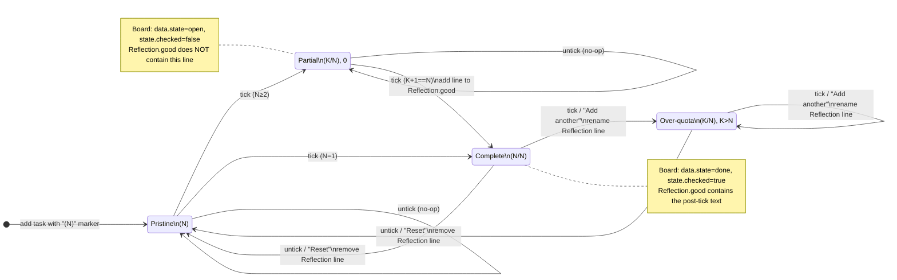

# Today tasks on Android

This note explains how the Today tab on the Android companion app is wired
to the Django backend. It covers the four endpoints, the service module
that orchestrates them, the two extension patterns (progress-counted
tasks; journal-note modal), and the wire contract.

## Why this exists

The web app already splits "what I plan to do today" into three records:

- `Board.state` (JSON tree of task nodes — the canonical task store)
- `Plan.focus` (today's plan, newline-joined lines of free text)
- `Reflection.good` (today's wins, newline-joined)

On the phone we wanted a single flat checklist with **add / check / delete**
that touches all three records consistently. The Android client sees a
plain CRUD surface; the backend does the small multi-record dance behind
each call.

## Endpoints

All four live under the existing mobile-API namespace and use the same
auth as `/api/v1/habit/track/`: DRF `TokenAuthentication` +
`IsAuthenticated`, `@csrf_exempt`, JSON request and response.

| Method | URL                                  | Body / query                                   | Returns                          |
|--------|--------------------------------------|------------------------------------------------|----------------------------------|
| GET    | `/api/v1/android/task/today/`        | `?date=YYYY-MM-DD`                             | `{"items":[{"text","done"}…]}`   |
| POST   | `/api/v1/android/task/add/`          | `{"text","date":"YYYY-MM-DD"}`                 | `{"ok": true}`                   |
| POST   | `/api/v1/android/task/complete/`     | `{"text","done","date":"<ISO 8601 ts>","note"?}` | `{"ok": true}`                 |
| POST   | `/api/v1/android/task/delete/`       | `{"text","date":"YYYY-MM-DD"}`                 | `{"ok": true}`                   |

Error model: `400` on missing/malformed input, `401` without a valid
token, `409` if the user has no `Board` on their configured thread, `200`
otherwise.

### Why `/complete` carries a full timestamp

Three of the four endpoints only need to know *which day* the user means,
so they pass a date-only string. `/complete` is different: every check
that comes with a free-form note is also recorded as a `JournalAdded`,
and that journal entry should carry the device's real wall-clock moment
of the tap — not a server-side synthesized noon. The Android client uses
`OffsetDateTime.now().toString()` (e.g. `2026-05-21T15:42:33.123+02:00`)
on `/complete` only; the server derives `pub_date = published.date()`
from it for Plan / Reflection lookup and uses the timestamp verbatim for
`JournalAdded.published`.

## Service module

`tasks/apps/tree/services/today/` contains everything the backend does
for these endpoints. The views are thin: parse, dispatch, translate
exceptions to HTTP.

```
services/today/
├── __init__.py        # public surface: add_task, set_task_done, ...
├── operations.py      # @transaction.atomic orchestrators
├── board_tree.py      # walking + mutating Board.state JSON
├── text_lines.py      # multiline-text helpers (Plan, Reflection.good)
└── progress.py        # progress-marker parsing / rendering
```

Each public operation in `operations.py` is wrapped in
`@transaction.atomic` — a board write, a Plan write, a Reflection write,
and (for `/complete` with a note) a `JournalAdded.create` either all
commit together or none do.

### Identity = text

Tasks are identified by exact-string equality everywhere on the wire and
internally. The Plan line *is* the identity. This keeps the contract
simple and matches how the web UI already types Plan lines. The trade-off
is that two identical lines collapse to one; in practice the user knows
this and rephrases.

### "Current board"

`Profile.default_board_thread` selects which `Thread` the Board lives on.
If that's unset, we fall back to the Daily thread so the operation never
silently no-ops. The most recent `Board` on the chosen thread is used.

### Operation semantics

- **Add (`add_task`)**: if the task text isn't already anywhere in the
  Board tree (DFS over `board_tree.find_task_by_text`), append a fresh
  node at root level (`board_operations.create_task_item`). Then ensure
  the line exists in today's `Plan.focus` via `add_unique_line`.
- **List (`list_today_tasks`)**: read today's `Plan.focus` lines; flag
  each as `done=True` iff it also appears in `Reflection.good`; sort
  unchecked first (preserving original Plan order within each group).
- **Set done (`set_task_done`)**: branches on whether the text matches a
  progress marker (see *Progress* below). For plain tasks: flip the
  board node's "done-ness" — both `data.state` (`open` ↔ `done`, used by
  the commit pipeline) *and* `state.checked` (boolean, what the Vue
  Board view actually renders) — and add/remove the line in
  `Reflection.good`. Also conditionally writes a `JournalAdded` (see
  *Journal-note modal* below). `board_tree.set_state` keeps both flags
  in lockstep so the Android tick is indistinguishable from a web-side
  checkbox click.
- **Delete (`delete_task`)**: remove the line from today's `Plan.focus`
  unconditionally; remove the board node only if it has no children;
  **leave `Reflection.good` untouched** so a task that was checked
  earlier still shows in the historical "what went well" record.

## Progress-counted tasks

A line whose text contains a counter — `Do tasks (3)`, `Buy (5) apples`,
`(2/4) Walk 1km` — advances one step per `/complete` tick rather than
flipping straight to done. The text itself mutates and stays in lockstep
across all three records.

Grammar: regex `\((\d+)(?:/(\d+))?\)`, first occurrence in the line wins.

- `(N)` (no slash) → `current=0, total=N` (pristine)
- `(K/N)` (slash) → `current=K, total=N`; `K` may exceed `N` (over-quota)
- `total < 1` is rejected (not a progress marker)

Render rules:

- `current == 0` → emit `(total)` form
- `current > 0` → emit `(current/total)` (over-quota is just printed
  verbatim, e.g. `(4/3)`)

State transitions (see `_next_progress_step`):

| State          | done=True (tick / Add another)      | done=False (Reset)               |
|----------------|-------------------------------------|----------------------------------|
| `(N)`          | → `(1/N)` if N>1 else `(N/N)`       | no-op                            |
| `(K/N)`, K<N-1 | → `(K+1/N)`                         | no-op                            |
| `(K/N)`, K==N-1| → `(N/N)`, mark done                | no-op                            |
| `(N/N)`        | → `(N+1/N)`, stays done             | → `(N)`, clear Reflection        |
| `(K/N)`, K>N   | → `(K+1/N)`, stays done             | → `(N)`, clear Reflection        |



A task is "done" whenever `current >= total`, so over-quota states like
`(4/3)` are still checked. The Reflection.good line is renamed in place
on stayed-done transitions; added on the not-done → done transition;
removed on the done → not-done transition.

Untick on pristine or partial states (`current < total`) is a no-op —
progress only flows forward, except for the explicit Reset.

`_set_task_done_progress` renames the board node (`board_tree.rename`),
replaces the Plan line (`text_lines.replace_line`), and updates
`Reflection.good` based on the done-before/done-after pair.

## Dialog flows

Tapping a row's checkbox opens one of two dialogs (or fires `/complete`
directly) depending on the task's current state.

### Add-note dialog — on tick

Triggered when the user ticks an *unchecked* row (`done = true` in the
ViewModel's `requestSetDone`). The dialog shows a multiline
`OutlinedTextField` with OK and Cancel buttons. `/complete` doesn't fire
until OK; on confirm, the optional `note` flows through to the server.

### Completed-task dialog — on tap of a fully-complete progress task

Triggered when the user taps a checked progress task — `(K/N)` with
`K >= N`. The dialog shows the task text, the note field, and three
actions: **Add another**, **Reset**, **Cancel**.

- **Add another** sends `done = true` with the note. The server advances
  `(K/N) → (K+1/N)` (the row stays checked) and records a journal entry
  for the over-quota advance.
- **Reset** sends `done = false` with no note. The server returns the
  task to pristine `(N)` and clears the `Reflection.good` line.
- **Cancel** (button or backdrop dismiss) does nothing — no API call,
  no row change.

The ViewModel detects "checked progress task" via a small Kotlin mirror
of the backend's progress regex (see
`TodayViewModel.isCompleteProgressTask`). Plain boolean done tasks skip
this path entirely and untick immediately on tap.

### JournalAdded creation rules

When the backend records a `JournalAdded`, the comment is:

```
- [x] <post-tick text>
<user-typed note (multi-line)>
```

The marker uses markdown task-list syntax (`- [x] `) so the journal
renders cleanly in the web view. **The entry deliberately bypasses
`services.journalling.process_journal_entry`** — the `[x]` prefix would
otherwise re-trigger `reflection_extraction.add_reflection_items`, which
would duplicate the line in `Reflection.good` that `_set_task_done_*`
already wrote there.

Rules:

- Created only on `done=True` (tick from the add-note dialog or Add
  another from the completed-task dialog).
- Reset (`done=False`) creates no journal entry.
- Plain-task untick (no dialog) creates no journal entry.
- Empty note (`""`) or missing `note` field: no `JournalAdded` —
  confirming an action without typed text counts as "just do the
  state change".
- For progress tasks the `[x]` line carries the **post-tick text**:
  ticking `Do tasks (2/3)` writes `- [x] Do tasks (3/3)`; "Add another"
  on `(3/3)` writes `- [x] Do tasks (4/3)`.

`JournalAdded.published` is the device's wall-clock timestamp from the
request (`timezone.now()` is the safe fallback for callers that don't
supply one, e.g., unit tests). The `event_stream_id` field is filled by
the existing `pre_save` signal handler in
`tasks/apps/tree/signals.py` — derived from the Daily thread.

## Android architecture

Compose UI on top of `kotlinx.coroutines` `StateFlow`s in a single
`AndroidViewModel`.

```
android/app/src/main/java/org/polybrain/tasks/health/
├── data/TasksApi.kt          # Retrofit interface + DTOs
├── data/TasksClient.kt       # OkHttp + Authorization: Token interceptor
├── data/Settings.kt          # DataStore: server URL + API token
├── ui/TodayScreen.kt         # Compose: LazyColumn, AddTaskRow, dialog
├── ui/TodayViewModel.kt      # tasks / loading / error / pendingComplete
└── ...
```

The ViewModel exposes four state flows: `tasks`, `loading`, `error`,
`configured`, `pendingComplete`. Mutations follow a common pattern:
optimistic local update → `api.<call>(…)` → on success or failure,
`reload()` reconciles against server truth. A null check on
`Settings.snapshot().isConfigured` short-circuits the request when the
user hasn't set a server URL + token yet.

Checkbox flow:

- `requestSetDone(text, done)` is the UI entry point.
  - `done = false` → fires `/complete` immediately, no modal.
  - `done = true` → stashes `PendingComplete(text)`; the modal observes
    `pendingComplete` and shows itself. No API call yet; no optimistic
    flip.
- `confirmCompletion(note)` (OK button) → optimistic flip, fire
  `/complete` with the note, reload.
- `cancelCompletion()` (Cancel button or backdrop dismiss) → clear
  pending state, no side effects.

Pull-to-refresh is wired via `PullToRefreshBox` whose `isRefreshing`
reflects `vm.loading`. The empty-state `Box` is given
`Modifier.verticalScroll(rememberScrollState())` so the nested-scroll
gesture also fires when the list is empty.

## Invariants worth preserving

- **All writes for a single endpoint share one transaction.** Don't
  split `Board.save()` out from the Plan/Reflection writes — partial
  state would surface immediately on the next list call.
- **Text identity is preserved through every operation.** When the text
  has to change (progress tick), update Board, Plan, *and* Reflection in
  the same transaction.
- **Reflection.good is treated as historical.** Delete leaves it alone;
  only `set_task_done(done=False)` clears the line, and only when
  transitioning out of fully-complete.
- **Journal entries from `/complete` never re-enter the reflection
  pipeline.** Always call `JournalAdded.objects.create(...)` directly;
  never call `process_journal_entry` on these entries.

## Where to start reading

For backend behavior: `services/today/operations.py` → `progress.py` →
`board_tree.py` + `text_lines.py`.

For the wire contract: `views_android_api.py`.

For the Android side: `ui/TodayScreen.kt` then `ui/TodayViewModel.kt`,
then `data/TasksApi.kt`.

Tests live in `tasks/apps/tree/tests/`:

- `test_today_tasks_service.py` — boolean lifecycle, atomicity, journal
  entry rules.
- `test_today_progress.py` — progress parsing, rendering, full
  lifecycle.
- `test_android_task_api.py` — end-to-end HTTP coverage.
